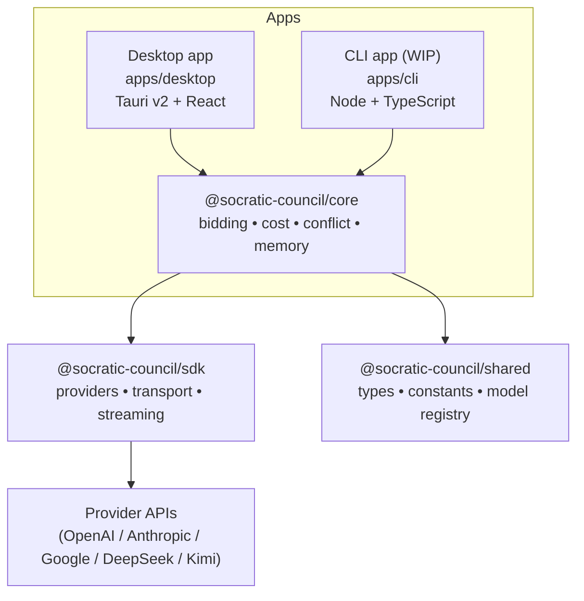
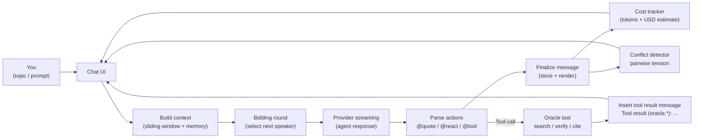
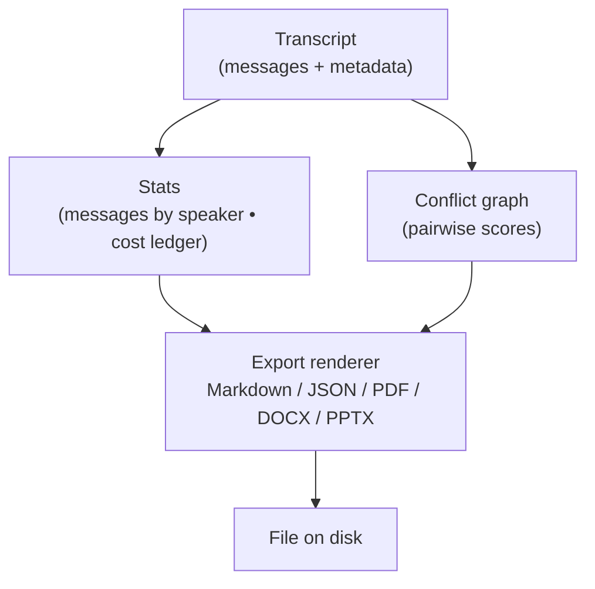

# Socratic Council

Socratic Council is a local-first desktop app that runs a seven-agent "seminar" on any topic. You provide one or more AI provider API keys, type a topic, and watch seven agents discuss it in a turn-taking group chat. The app includes search, quoting, export, conflict visualization, and token/cost tracking.

This repo ships **source only** (no installer downloads). Follow this guide to build it from source.

At a glance:
- **Local-first** — runs entirely on your machine
- **Bring-your-own-keys** — uses real provider APIs (OpenAI, Anthropic, Google Gemini, DeepSeek, Kimi, Qwen, MiniMax)
- **Multi-agent** — seven speakers + optional moderator
- **Built-in tools** — quoting, reactions, search, export, conflict graph, cost ledger

---

## Quick install (macOS)

If you just want to build and install the app in one shot:

```bash
git clone https://github.com/richer-richard/socratic-council.git
cd socratic-council
./install.sh
```

The script automatically checks for (and installs if missing) Xcode CLT, Homebrew, Node.js 22+, pnpm, and Rust — then builds the production `.app` bundle, copies `Socratic Council.app` to `/Applications`, and opens the app.

> **Already have everything installed?** The script detects existing tools and skips them (it will upgrade if needed but never downgrade).

For a manual step-by-step walkthrough, see [Build from source](#build-from-source) below.

---

## Table of contents

- [Quick install (macOS)](#quick-install-macos)
- [Build from source](#build-from-source)
  - [Requirements summary](#requirements-summary)
  - [Step 1 — Install system prerequisites](#step-1--install-system-prerequisites)
    - [macOS](#macos)
    - [Windows](#windows)
    - [Linux (Debian / Ubuntu)](#linux-debian--ubuntu)
    - [Linux (Fedora)](#linux-fedora)
    - [Linux (Arch)](#linux-arch)
  - [Step 2 — Install Node.js](#step-2--install-nodejs)
  - [Step 3 — Install Rust](#step-3--install-rust)
  - [Step 4 — Enable pnpm](#step-4--enable-pnpm)
  - [Step 5 — Clone and install](#step-5--clone-and-install)
  - [Step 6 — Run in development mode](#step-6--run-in-development-mode)
  - [Step 7 — Build a production binary](#step-7--build-a-production-binary)
  - [Verification checklist](#verification-checklist)
- [How it works](#how-it-works)
  - [Architecture](#architecture)
  - [Conversation loop](#conversation-loop)
  - [Export pipeline](#export-pipeline)
- [First run setup](#first-run-setup)
  - [API keys](#api-keys)
  - [Models](#models)
  - [Proxy](#proxy)
  - [Moderator](#moderator)
- [Using the app](#using-the-app)
  - [Home](#home)
  - [Chat](#chat)
  - [Pause, resume, stop](#pause-resume-stop)
  - [Search](#search)
  - [Export](#export)
  - [Logs](#logs)
- [Tool calling (oracle)](#tool-calling-oracle)
- [Troubleshooting](#troubleshooting)
- [Developer workflows](#developer-workflows)
- [Monorepo layout](#monorepo-layout)
- [License](#license)

---

## Build from source

This section walks you through every dependency and build step from a clean machine to a running app. Read it top to bottom; each step depends on the previous one.

### Requirements summary

| Dependency | Minimum version | Why |
|---|---|---|
| **Git** | any recent | Clone the repository |
| **Node.js** | **≥ 22.0.0** | Run the frontend toolchain (Vite, TypeScript, build scripts) |
| **pnpm** | **9.15.0** (exact, via corepack) | Workspace package manager — the repo's `packageManager` field pins this version |
| **Rust** | **stable ≥ 1.77.2** | Compile the Tauri v2 native backend |
| **Tauri v2 system deps** | (per OS, see below) | WebView, native build tools |

The Tauri CLI (`@tauri-apps/cli ^2.5.0`) is declared as a devDependency and installed automatically by `pnpm install` — you do **not** install it globally.

---

### Step 1 — Install system prerequisites

These are OS-level packages that Tauri needs to compile its native code and embed a WebView. Pick **your platform** below.

> **Canonical reference:** the [official Tauri v2 prerequisites page](https://v2.tauri.app/start/prerequisites/) is the upstream source of truth. The commands below are reproduced for convenience but may drift over time; cross-check with the Tauri docs if something fails.

#### macOS

1. **Xcode Command Line Tools** (provides the Apple clang compiler, linker, macOS SDK):

   ```bash
   xcode-select --install
   ```

   If you already have the full Xcode IDE installed, this step is satisfied automatically. After installation, verify:

   ```bash
   xcode-select -p
   # expected: /Library/Developer/CommandLineTools  or  /Applications/Xcode.app/Contents/Developer
   ```

   ```bash
   cc --version
   # expected: Apple clang version 15.x or newer
   ```

   > **Tip:** If you see errors about missing SDKs or headers when building later, open the full Xcode IDE once and accept the license. Then re-run `xcode-select --install`.

No other system packages are required on macOS — the WebView is provided by the OS (WKWebView).

#### Windows

1. **Microsoft Visual Studio C++ Build Tools** — Rust on Windows requires the MSVC toolchain.

   - Download **Visual Studio Build Tools** from <https://visualstudio.microsoft.com/visual-cpp-build-tools/>.
   - In the installer, select the **"Desktop development with C++"** workload. This installs:
     - MSVC v143 (or later) C++ compiler
     - Windows SDK
     - CMake (bundled)

   After installation, open a **new** terminal and verify:

   ```powershell
   cl
   # expected: Microsoft (R) C/C++ Optimizing Compiler ...
   ```

   If `cl` is not on your PATH, use the "Developer Command Prompt for VS" or the "x64 Native Tools Command Prompt".

2. **WebView2 Runtime** — Tauri embeds a WebView2-based window.

   - **Windows 11** and **Windows 10 ≥ 1803** ship with WebView2 pre-installed. Verify:

     ```powershell
     Get-ItemProperty -Path "HKLM:\SOFTWARE\WOW6432Node\Microsoft\EdgeUpdate\Clients\{F3017226-FE2A-4295-8BDF-00C3A9A7E4C5}" -Name pv -ErrorAction SilentlyContinue | Select-Object pv
     ```

     If this returns a version number (e.g. `130.x.xxxx.xx`), WebView2 is installed.

   - If not present, download the **Evergreen Bootstrapper** from <https://developer.microsoft.com/en-us/microsoft-edge/webview2/> and run it.

3. **Rust toolchain target** — ensure Rust uses the MSVC backend:

   ```powershell
   rustup default stable-msvc
   ```

#### Linux (Debian / Ubuntu)

```bash
sudo apt update
sudo apt install -y \
  build-essential \
  curl \
  wget \
  file \
  libwebkit2gtk-4.1-dev \
  libxdo-dev \
  libssl-dev \
  libayatana-appindicator3-dev \
  librsvg2-dev
```

Verify the critical package:

```bash
pkg-config --modversion webkitgtk-4.1
# expected: 2.42.x or newer
```

#### Linux (Fedora)

```bash
sudo dnf check-update
sudo dnf install -y \
  webkit2gtk4.1-devel \
  openssl-devel \
  curl \
  wget \
  file \
  libappindicator-gtk3-devel \
  librsvg2-devel \
  libxdo-devel
sudo dnf group install -y "C Development Tools and Libraries"
```

#### Linux (Arch)

```bash
sudo pacman -Syu --noconfirm
sudo pacman -S --needed --noconfirm \
  webkit2gtk-4.1 \
  base-devel \
  curl \
  wget \
  file \
  openssl \
  appmenu-gtk-module \
  libappindicator-gtk3 \
  librsvg \
  xdotool
```

---

### Step 2 — Install Node.js

This project requires **Node.js ≥ 22.0.0** (enforced in the root `package.json` `engines` field). Node.js ships with `corepack`, which is used to activate pnpm in the next step.

**Option A — nvm (recommended for macOS / Linux):**

```bash
# Install nvm (if you don't have it)
curl -o- https://raw.githubusercontent.com/nvm-sh/nvm/v0.40.1/install.sh | bash

# Reload your shell, then:
nvm install 22
nvm use 22
```

**Option B — fnm (cross-platform alternative):**

```bash
# macOS / Linux
curl -fsSL https://fnm.vercel.app/install | bash

# Windows (PowerShell)
winget install Schniz.fnm

# Then:
fnm install 22
fnm use 22
```

**Option C — Direct download:**

Download from <https://nodejs.org/> (pick the v22 LTS line or later).

**Verify:**

```bash
node -v
# expected: v22.x.x  (must be ≥ 22.0.0)
```

```bash
corepack -v
# expected: 0.29.x or newer (ships with Node 22)
```

---

### Step 3 — Install Rust

Tauri v2 compiles a Rust binary as the native backend. You need a **stable** Rust toolchain ≥ 1.77.2.

**macOS / Linux:**

```bash
curl --proto '=https' --tlsv1.2 https://sh.rustup.rs -sSf | sh
```

Follow the prompts (default installation is fine). Then reload your shell:

```bash
source "$HOME/.cargo/env"
```

**Windows (PowerShell):**

```powershell
winget install --id Rustlang.Rustup
```

Or download the installer from <https://rustup.rs/>.

After installation, close and reopen your terminal, then set the MSVC default:

```powershell
rustup default stable-msvc
```

**Verify (all platforms):**

```bash
rustc -V
# expected: rustc 1.77.2 (or newer)

cargo -V
# expected: cargo 1.77.2 (or newer)

rustup show
# look for: "stable" and your platform triple (e.g. aarch64-apple-darwin, x86_64-pc-windows-msvc)
```

**Updating an existing installation:**

```bash
rustup update stable
```

---

### Step 4 — Enable pnpm

This repo uses `pnpm` as its workspace package manager. The exact version (`9.15.0`) is pinned in the root `package.json` `"packageManager"` field. **Corepack** (bundled with Node.js) will automatically download and use the correct version — you do not install pnpm globally.

```bash
corepack enable
```

Verify:

```bash
pnpm -v
# expected: 9.15.0
```

> **Note:** If `corepack enable` fails with a permissions error, you may need `sudo corepack enable` (Linux/macOS) or run your terminal as Administrator (Windows).

---

### Step 5 — Clone and install

```bash
git clone https://github.com/richer-richard/socratic-council.git
cd socratic-council
```

Install all workspace dependencies (JavaScript/TypeScript packages across the monorepo):

```bash
pnpm install
```

This runs pnpm's workspace resolution and installs dependencies for all packages:

| Workspace | Path | What it installs |
|---|---|---|
| `@socratic-council/shared` | `packages/shared` | Shared types, constants, model registry |
| `@socratic-council/sdk` | `packages/sdk` | Provider SDK (OpenAI, Anthropic, Google, DeepSeek, Kimi, Qwen, MiniMax), transport layer |
| `@socratic-council/core` | `packages/core` | Council orchestration logic (bidding, conflict, cost, memory) |
| `@socratic-council/desktop` | `apps/desktop` | Tauri v2 + React frontend, Tauri CLI (`@tauri-apps/cli`) |
| `@socratic-council/cli` | `apps/cli` | CLI app (work in progress) |

Verify installation succeeded:

```bash
# All workspace packages should be listed
pnpm ls -r --depth 0
```

---

### Step 6 — Run in development mode

```bash
pnpm --filter @socratic-council/desktop tauri:dev
```

**What this command does, in order:**

1. Tauri CLI starts (`tauri dev`).
2. Tauri runs the `beforeDevCommand` from `tauri.conf.json`, which is `pnpm dev` — this launches **Vite** on `http://localhost:1420`.
3. Tauri compiles the Rust backend in `apps/desktop/src-tauri/` using `cargo build`. On the **first run**, Cargo downloads and compiles all Rust crate dependencies (Tauri itself, reqwest, tokio, serde, etc.). This can take **5–15 minutes** depending on your machine.
4. Once both the frontend dev server and the Rust binary are ready, a native window opens showing the app.

> **First-run expectations:**
> - You will see Cargo downloading and compiling ~300+ crates. This is normal.
> - Subsequent runs are fast because Cargo caches compiled artifacts in `apps/desktop/src-tauri/target/`.
> - If the window appears but shows a blank page, wait a few seconds for Vite to finish compiling the frontend.

**Dev mode features:**
- Hot-reload for frontend changes (Vite HMR).
- Rust changes require a restart of the `tauri:dev` command.
- DevTools window opens automatically in debug builds.

---

### Step 7 — Build a production binary

To produce an optimized, distributable binary:

```bash
pnpm --filter @socratic-council/desktop tauri:build
```

**What this command does, in order:**

1. Tauri CLI starts (`tauri build`).
2. Tauri runs the `beforeBuildCommand` from `tauri.conf.json`, which is `pnpm build`. This:
   - Builds `@socratic-council/shared` (TypeScript → JS via tsup)
   - Builds `@socratic-council/sdk` (TypeScript → JS via tsup)
   - Builds `@socratic-council/core` (TypeScript → JS via tsup)
   - Runs `tsc` type-checking on the desktop frontend
   - Runs `vite build` to produce the optimized frontend bundle in `apps/desktop/dist/`
3. Tauri compiles the Rust backend in **release mode** (`cargo build --release`) with the following optimizations (from `Cargo.toml`):
   - `lto = true` — link-time optimization
   - `codegen-units = 1` — single codegen unit for maximum optimization
   - `opt-level = "s"` — optimize for binary size
   - `strip = true` — strip debug symbols
4. Tauri bundles the frontend + binary into a platform-specific distributable.

**Build output locations:**

| Platform | Output path | Format |
|---|---|---|
| macOS | `apps/desktop/src-tauri/target/release/bundle/macos/Socratic Council.app` | `.app` bundle |
| macOS | `apps/desktop/src-tauri/target/release/bundle/dmg/Socratic Council_*.dmg` | `.dmg` disk image |
| Windows | `apps/desktop/src-tauri/target/release/bundle/msi/Socratic Council_*.msi` | `.msi` installer |
| Windows | `apps/desktop/src-tauri/target/release/bundle/nsis/Socratic Council_*-setup.exe` | NSIS installer |
| Linux | `apps/desktop/src-tauri/target/release/bundle/deb/socratic-council_*.deb` | `.deb` package |
| Linux | `apps/desktop/src-tauri/target/release/bundle/appimage/socratic-council_*.AppImage` | `.AppImage` |

> **Note:** The release build is significantly slower than a dev build (10–30 minutes) due to LTO and maximum optimizations. The resulting binary is much smaller and faster.

---

### Verification checklist

Run these commands after installation to confirm everything is in place. All must pass before you can build:

```bash
# 1. Git
git --version
# ✓ any recent version

# 2. Node.js
node -v
# ✓ must be v22.x.x or higher

# 3. pnpm (via corepack)
pnpm -v
# ✓ must be 9.15.0

# 4. Rust compiler
rustc -V
# ✓ must be 1.77.2 or higher

# 5. Cargo
cargo -V
# ✓ must match rustc version

# 6. Tauri CLI (installed as a project devDependency)
pnpm --filter @socratic-council/desktop tauri --version
# ✓ must be 2.x.x

# 7. Workspace packages resolved
pnpm ls -r --depth 0 2>/dev/null | head -20
# ✓ should list @socratic-council/shared, sdk, core, desktop, cli

# 8. System libraries (Linux only)
pkg-config --modversion webkitgtk-4.1
# ✓ Linux only: must return a version number
```

If any of these fail, revisit the corresponding step above.

---

## How it works

### Architecture

Socratic Council is a pnpm monorepo with a desktop app and shared TypeScript packages.



### Conversation loop

At runtime the app repeatedly selects a speaker, streams their response, applies structured "actions" in the text, then updates the UI and analytics.



### Export pipeline

Exports are generated locally from the transcript plus computed statistics (speaker counts, tokens, costs, conflict graph).



---

## First run setup

On first launch, configure providers and models in **Settings**.

### API keys

Socratic Council uses real provider APIs — you bring your own keys. Supported providers:

| Provider | API key source |
|---|---|
| OpenAI | <https://platform.openai.com/api-keys> |
| Anthropic | <https://console.anthropic.com/settings/keys> |
| Google (Gemini) | <https://aistudio.google.com/apikey> |
| DeepSeek | <https://platform.deepseek.com/api_keys> |
| Kimi (Moonshot) | <https://platform.moonshot.cn/console/api-keys> |

Keys are stored **locally on your machine** in the Tauri plugin-store. This repo does not run a server.

### Models

Each provider supports multiple models. The Settings screen lets you choose:
- The default model per provider
- The model used by each agent (optional, depending on the UI configuration)

### Proxy

If you need a proxy (corporate networks, regions requiring proxy access, etc.), configure it in Settings. The app supports HTTP and SOCKS5 proxies (via reqwest) and uses a single global proxy for all providers.

### Moderator

The "Moderator" is a system-role agent that can inject short guidance when tension is detected or when the conversation drifts. You can toggle the Moderator on or off in Settings.

---

## Using the app

### Home

From the home screen you can:
- Start a new discussion (enter a topic)
- Open settings

### Chat

The chat timeline shows:
- Messages by speaker (color-coded by agent)
- Per-message token usage (when available)
- Per-message cost estimate (when available)
- Inline quotes and reactions between agents

### Pause, resume, stop

During a discussion you can:
- **Pause** — temporarily halt generation
- **Resume** — continue from where you paused
- **Stop** — end the session early

### Search

Search lets you:
- Find text in the transcript
- Jump directly to the matching message in the timeline

### Export

The app can export a conversation to:
- Markdown
- JSON
- PDF
- DOCX
- PPTX

Exports are generated locally.

| Format | Best for | Notes |
|---|---|---|
| Markdown | Sharing in docs/issues | Plain text, easiest to diff |
| JSON | Programmatic processing | Stable schema for tooling |
| PDF | Printing / sending | Includes charts and summaries |
| DOCX | Editing in Word | Structured sections, tables |
| PPTX | Slides / presentation | Graphics-first summary |

### Logs

Logs are intended for debugging provider calls and app behavior. If something looks wrong, logs often explain why.

---

## Tool calling (oracle)

Agents can request web-style lookup/verification via a built-in "oracle" tool call.

What an agent writes (inside an AI message):

```text
@tool(oracle.search, {"query":"..."})
```

What you see next in the transcript:

```text
Tool result (oracle.search): ...
```

That "Tool result" line is not an error — it is a normal message inserted by the app after the oracle tool returns.

---

## Troubleshooting

### Quick diagnostics

Run these from the repo root and include the output in any bug report:

```bash
echo "--- OS ---"
uname -a 2>/dev/null || ver

echo "--- Node ---"
node -v

echo "--- pnpm ---"
pnpm -v

echo "--- Rust ---"
rustc -V
cargo -V

echo "--- Tauri CLI ---"
pnpm --filter @socratic-council/desktop tauri --version
```

### Common build errors

#### `command not found: pnpm`

**Cause:** Corepack is not enabled or Node.js is too old.

**Fix:**

```bash
corepack enable
pnpm -v
```

If `corepack` itself is not found, your Node.js version is too old — install Node ≥ 22.

#### First Cargo build fails with network errors

**Cause:** Cargo needs to download crate dependencies from crates.io on the first build.

**Fix:** Ensure you have internet access. If you are behind a corporate proxy, configure Cargo's proxy:

```bash
# ~/.cargo/config.toml
[http]
proxy = "http://your-proxy:port"
```

#### Tauri dependency errors on Linux (`webkit2gtk` / `openssl` / `appindicator`)

**Cause:** Missing system development libraries.

**Fix:** Install the packages listed in [Linux prerequisites](#linux-debian--ubuntu) for your distro, then clean and rebuild:

```bash
pnpm clean
pnpm install
pnpm --filter @socratic-council/desktop tauri:dev
```

#### Windows build errors mentioning `MSVC` / `cl.exe` / `link.exe`

**Cause:** The MSVC C++ toolchain is not installed or Rust is using the wrong backend.

**Fix:**

1. Install Visual Studio Build Tools → select "Desktop development with C++".
2. Ensure Rust targets MSVC:
   ```powershell
   rustup default stable-msvc
   ```
3. Re-open your terminal.

#### Blank window or WebView errors on Windows

**Cause:** WebView2 Runtime is not installed.

**Fix:** Install the WebView2 Evergreen Runtime from <https://developer.microsoft.com/en-us/microsoft-edge/webview2/>.

#### macOS linker errors / missing SDK

**Cause:** Xcode Command Line Tools are not installed or are outdated.

**Fix:**

```bash
xcode-select --install
# If that doesn't help, open the full Xcode IDE and accept the license, then retry.
```

#### `ERR_PNPM_UNSUPPORTED_ENGINE` — engine "node" is incompatible

**Cause:** Your Node.js version is below 22.

**Fix:** Upgrade Node.js to v22+ (see [Step 2](#step-2--install-nodejs)).

#### Stale cache / corrupted `node_modules`

**Fix:**

```bash
pnpm clean          # removes all node_modules and dist folders
pnpm install        # fresh install
```

#### Rust compilation is extremely slow

**Tip:** The first dev build compiles Tauri and all Rust dependencies (~300 crates). This is normal. Subsequent builds are incremental and much faster.

For production builds (`tauri:build`), LTO is enabled in `Cargo.toml`, which increases compile time significantly but produces a smaller, faster binary. This is expected.

---

## Developer workflows

### Desktop — development mode

```bash
pnpm --filter @socratic-council/desktop tauri:dev
```

- Frontend hot-reloads via Vite HMR.
- Rust changes require restarting the command.
- DevTools opens automatically in debug builds.

### Desktop — production build

```bash
pnpm --filter @socratic-council/desktop tauri:build
```

Output is placed in `apps/desktop/src-tauri/target/release/bundle/`.

### Build only TypeScript packages

```bash
pnpm build
```

This builds all workspace packages (`shared` → `sdk` → `core` → apps).

### CLI (work in progress)

```bash
pnpm --filter @socratic-council/cli dev     # watch mode
pnpm --filter @socratic-council/cli build   # one-shot build
pnpm --filter @socratic-council/cli start   # run built CLI
```

### Tests

```bash
pnpm test
```

Runs `vitest` across all workspace packages.

### Linting and formatting

```bash
pnpm lint            # ESLint across all packages
pnpm format          # Prettier — write
pnpm format:check    # Prettier — check only
pnpm typecheck       # TypeScript type checking (no emit)
```

### Clean everything

```bash
pnpm clean
```

This removes all `node_modules/`, `dist/`, and build artifacts. You'll need to run `pnpm install` again afterward. Note: this does **not** clear the Cargo build cache in `apps/desktop/src-tauri/target/`. To fully clean the Rust build:

```bash
cd apps/desktop/src-tauri && cargo clean && cd -
```

---

## Monorepo layout

```
socratic-council/
├── apps/
│   ├── desktop/                 # Tauri v2 + React desktop app
│   │   ├── src/                 # React frontend (TypeScript, TSX)
│   │   ├── src-tauri/           # Rust backend (Tauri commands, HTTP proxy)
│   │   │   ├── src/             # Rust source (lib.rs, main.rs, http.rs)
│   │   │   ├── Cargo.toml       # Rust dependencies
│   │   │   └── tauri.conf.json  # Tauri configuration
│   │   ├── vite.config.ts       # Vite bundler config
│   │   └── package.json
│   └── cli/                     # CLI app (work in progress)
│       ├── src/index.ts
│       └── package.json
├── packages/
│   ├── shared/                  # Types, constants, model registry
│   ├── sdk/                     # Provider SDK (transport, streaming, SSE)
│   └── core/                    # Council logic (bidding, conflict, cost, memory)
├── install.sh                   # One-command quick install (macOS)
├── package.json                 # Root workspace config
├── pnpm-workspace.yaml          # Workspace package globs
├── tsconfig.base.json           # Shared TypeScript base config
├── vitest.config.ts             # Shared test config
├── eslint.config.js             # Shared ESLint config
└── LICENSE                      # Apache-2.0
```

---

## License

Apache-2.0 — see [`LICENSE`](LICENSE).
