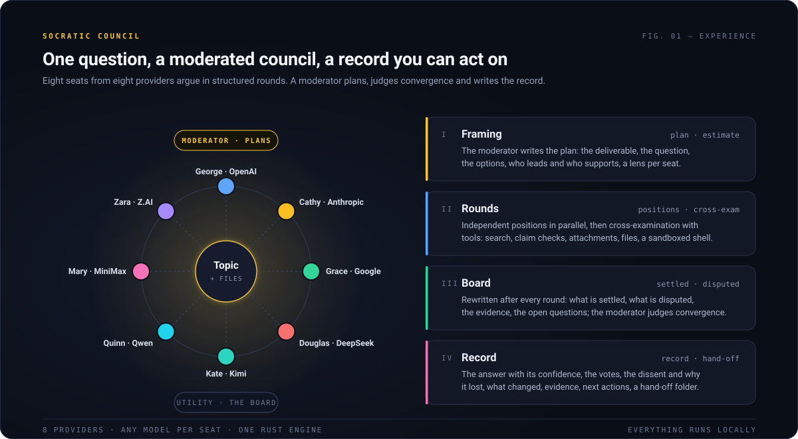
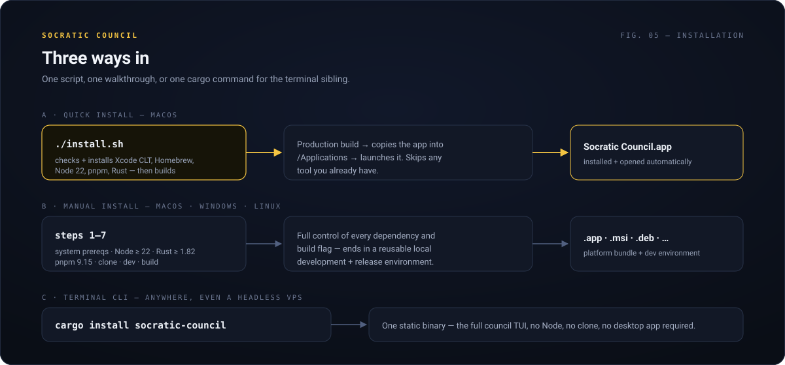
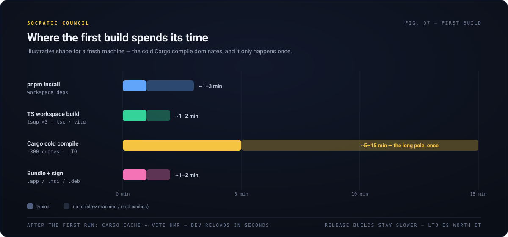
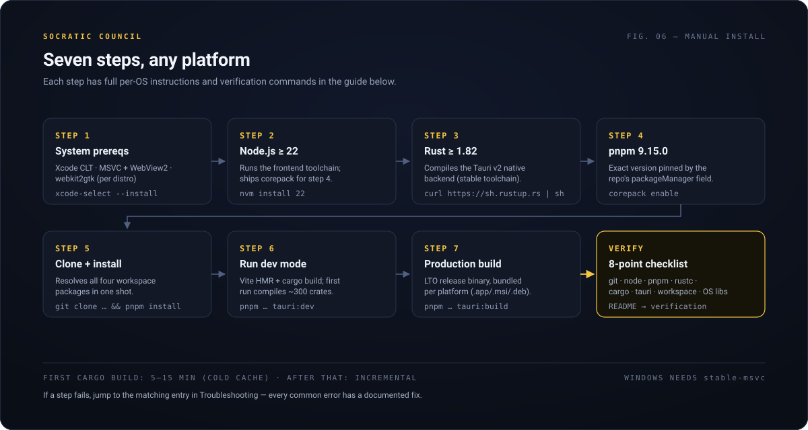
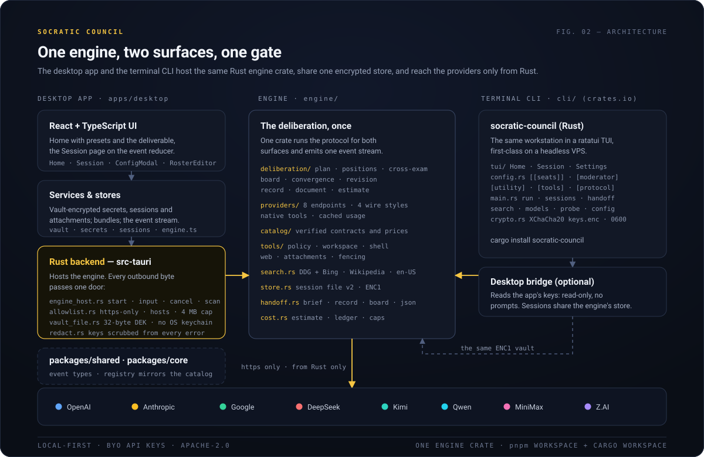
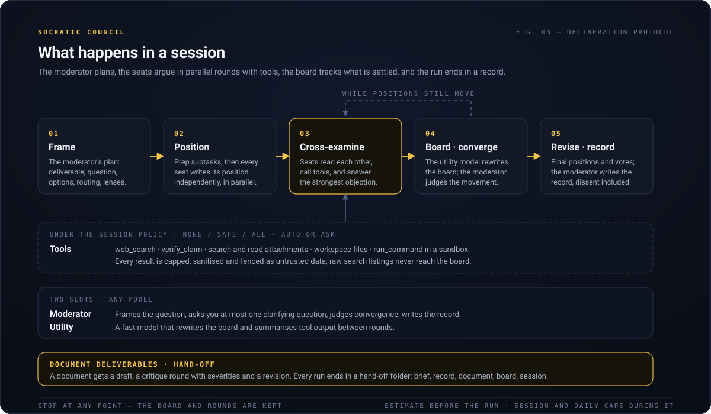
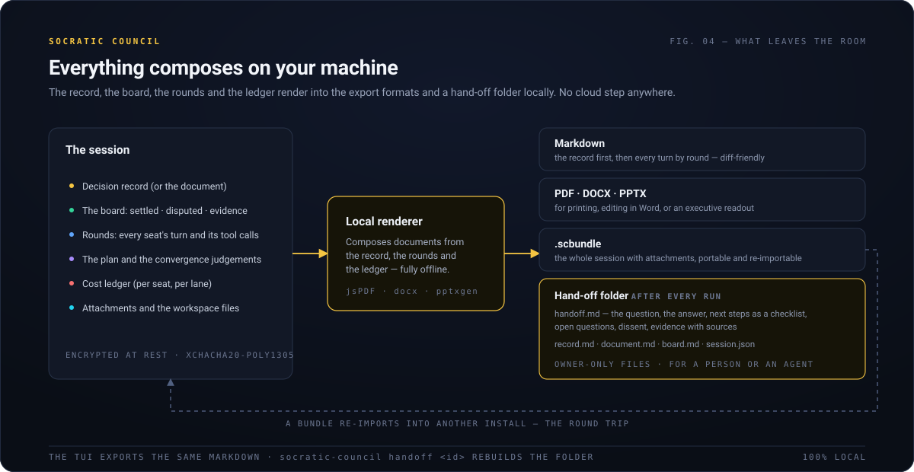

<p align="center">
  
</p>

# Socratic Council

Socratic Council is a local-first desktop app that convenes a council of frontier models to settle a question. You bring provider API keys, type a topic, optionally attach files, and a moderator frames the question, routes the hard parts to the strongest seats and the small parts to the fast ones, runs independent positions and cross-examination rounds with tools until the seats converge, and writes a decision record: the answer, its confidence, the dissent, what changed and why, the evidence, the open questions and the next actions. A document deliverable gets a draft, a critique round and a revision instead. One Rust engine runs the whole protocol for the desktop app and the terminal alike.

The same workstation also ships as a standalone **terminal sibling**: the [`socratic-council` CLI/TUI](cli/README.md), installable with one `cargo install socratic-council` — no Node, no desktop app required, first-class on a headless VPS.

This repo ships source only (no installer downloads). Follow this guide to build it from source.

> Use `install.sh` as the quick install script on macOS, follow the manual installation guide in this README for the current step-by-step setup on macOS, Windows, or Linux — or `cargo install socratic-council` for the terminal CLI.

## Snapshot

| Dimension        | Details                                                                                                                     |
| ---------------- | --------------------------------------------------------------------------------------------------------------------------- |
| Product          | Local-first Tauri desktop app + standalone terminal CLI/TUI                                                                 |
| Stack            | React + TypeScript frontend, Rust backend, pnpm monorepo, Rust CLI crate                                                    |
| Discussion model | A moderator plus any roster of seats (eight by default, any model per provider), structured rounds, a decision record       |
| Providers        | OpenAI, Anthropic, Google Gemini, DeepSeek, Kimi, Qwen, MiniMax, Z.AI                                                       |
| Research tools   | File search, web search, claim verification, source-anchored citations                                                      |
| Outputs          | Decision record or document, the board (settled points, disagreements, evidence), the rounds, cost ledger, exports, bundles |

| Workflow Surface   | Included                                                                            |
| ------------------ | ----------------------------------------------------------------------------------- |
| Live deliberation  | Framing, prep subtasks, parallel positions, cross-examination, revision with votes  |
| Evidence gathering | Attachments, web search, claim verification, workspace files, a sandboxed shell     |
| Sense-making       | The board, convergence checks, the decision record with dissent and what changed    |
| Observability      | Latency, tokens, cost tracking, daily and per-session budgets, redacted diagnostics |
| Review and sharing | Copy the record as Markdown, structured exports, portable `.scbundle` archive       |

## Experience Map



## Council Lineup

Eight seats are configured by default, one per provider. Settings lets you rename them, change their model (any model the provider serves, or Auto at a reasoning level), pin a reasoning level per seat, add more seats on any provider, or remove some; seats without a key are skipped. The Quick, Standard and Full presets on the home page convene 3, 4 or all keyed seats.

| Agent     | Provider  | Default model                                                  |
| --------- | --------- | -------------------------------------------------------------- |
| George    | OpenAI    | GPT-6 Astra                                                    |
| Cathy     | Anthropic | Claude Fable 5.1                                               |
| Grace     | Google    | Gemini 3.1 Pro                                                 |
| Douglas   | DeepSeek  | DeepSeek V4 Pro                                                |
| Kate      | Kimi      | Kimi K3                                                        |
| Quinn     | Qwen      | Qwen 3.8 Max                                                   |
| Mary      | MiniMax   | MiniMax M3                                                     |
| Zara      | Z.AI      | GLM-5.3                                                        |
| Moderator | Google    | Gemini 3.1 Pro (falls back to whatever provider is configured) |

## Installation Paths

| Path                                         | Platform                          | Best for                                          | Result                                                        |
| -------------------------------------------- | --------------------------------- | ------------------------------------------------- | ------------------------------------------------------------- |
| Quick install via [`install.sh`](install.sh) | macOS                             | Fastest way to get the app installed locally      | Builds the app, copies it to `/Applications`, and launches it |
| Manual install via the guide below           | macOS / Windows / Linux           | Full control over prerequisites and build steps   | Sets up a reusable local development/build environment        |
| `cargo install socratic-council`             | macOS / Windows / Linux / any VPS | The terminal workstation, no desktop app required | Installs the [`socratic-council` CLI/TUI](cli/README.md)      |



### First build profile

Illustrative first-run shape for a fresh machine:



---

## Quick install (macOS)

`install.sh` is the repo's **quick install script**. It is the fastest path on macOS, but the manual installation guide below remains the current source-of-truth walkthrough if you want to inspect or customize every step.

If you want to build and install the app in one shot:

```bash
git clone https://github.com/richer-richard/socratic-council.git
cd socratic-council
./install.sh
```

The script automatically checks for (and installs if missing) Xcode CLT, Homebrew, Node.js 22+, pnpm, and Rust, then builds the production `.app` bundle, copies `Socratic Council.app` to `/Applications`, and opens the app.

| Quick install behavior | What happens                                        |
| ---------------------- | --------------------------------------------------- |
| Prerequisites          | Checks Xcode CLT, Homebrew, Node.js, pnpm, and Rust |
| Build                  | Runs the full production desktop build              |
| Install                | Copies `Socratic Council.app` into `/Applications`  |
| Launch                 | Opens the installed app automatically               |

> Already have everything installed? The script detects existing tools and skips what it can.

For the current manual installation guide, see [Build from source (manual install guide)](#build-from-source-manual-install-guide) below.

---

## Table of contents

- [Snapshot](#snapshot)
- [Experience Map](#experience-map)
- [Council Lineup](#council-lineup)
- [Installation Paths](#installation-paths)
- [Quick install (macOS)](#quick-install-macos)
- [Build from source (manual install guide)](#build-from-source-manual-install-guide)
  - [Requirements summary](#requirements-summary)
  - [Step 1: Install system prerequisites](#step-1-install-system-prerequisites)
    - [macOS](#macos)
    - [Windows](#windows)
    - [Linux (Debian / Ubuntu)](#linux-debian--ubuntu)
    - [Linux (Fedora)](#linux-fedora)
    - [Linux (Arch)](#linux-arch)
  - [Step 2: Install Node.js](#step-2-install-nodejs)
  - [Step 3: Install Rust](#step-3-install-rust)
  - [Step 4: Enable pnpm](#step-4-enable-pnpm)
  - [Step 5: Clone and install](#step-5-clone-and-install)
  - [Step 6: Run in development mode](#step-6-run-in-development-mode)
  - [Step 7: Build a production binary](#step-7-build-a-production-binary)
  - [Verification checklist](#verification-checklist)
- [How it works](#how-it-works)
  - [Architecture](#architecture)
  - [Conversation loop](#conversation-loop)
  - [Export pipeline](#export-pipeline)
- [First run setup](#first-run-setup)
  - [API keys](#api-keys)
  - [Models](#models)
  - [Proxy](#proxy)
  - [Moderator](#moderator)
- [Using the app](#using-the-app)
  - [Home](#home)
  - [Session](#session)
  - [Export](#export)
  - [Logs](#logs)
- [Tool calling (oracle)](#tool-calling-oracle)
- [Troubleshooting](#troubleshooting)
- [Developer workflows](#developer-workflows)
- [Terminal CLI](#terminal-cli)
- [Monorepo layout](#monorepo-layout)
- [License](#license)

---

## Build from source (manual install guide)

This is the current manual installation guide for the repo. If you do not want to use `install.sh`, or if you are on Windows or Linux, follow this section from top to bottom.



### Requirements summary

| Track          | Use this when                                                  | Entry point     |
| -------------- | -------------------------------------------------------------- | --------------- |
| Quick install  | You want the macOS app installed as fast as possible           | `./install.sh`  |
| Manual install | You want explicit control over dependencies and build commands | Steps 1-7 below |

| Dependency               | Minimum version                  | Why                                                                            |
| ------------------------ | -------------------------------- | ------------------------------------------------------------------------------ |
| **Git**                  | any recent                       | Clone the repository                                                           |
| **Node.js**              | **≥ 22.0.0**                     | Run the frontend toolchain (Vite, TypeScript, build scripts)                   |
| **pnpm**                 | **9.15.0** (exact, via corepack) | Workspace package manager. The repo's `packageManager` field pins this version |
| **Rust**                 | **stable ≥ 1.77.2**              | Compile the Tauri v2 native backend                                            |
| **Tauri v2 system deps** | (per OS, see below)              | WebView, native build tools                                                    |

The Tauri CLI (`@tauri-apps/cli ^2.5.0`) is declared as a devDependency and installed automatically by `pnpm install`, so you do **not** install it globally.

---

### Step 1: Install system prerequisites

These are OS-level packages that Tauri needs to compile its native code and embed a WebView. Pick **your platform** below.

> **Canonical reference:** the [official Tauri v2 prerequisites page](https://v2.tauri.app/start/prerequisites/) is the upstream source of truth. The commands below are reproduced for convenience but may drift over time; cross-check with the Tauri docs if something fails.

#### macOS

1. **Xcode Command Line Tools** (provides the Apple clang compiler, linker, macOS SDK):

   ```bash
   xcode-select --install
   ```

   If you already have the full Xcode IDE installed, this step is satisfied automatically. After installation, verify:

   ```bash
   xcode-select -p
   # expected: /Library/Developer/CommandLineTools  or  /Applications/Xcode.app/Contents/Developer
   ```

   ```bash
   cc --version
   # expected: Apple clang version 15.x or newer
   ```

   > **Tip:** If you see errors about missing SDKs or headers when building later, open the full Xcode IDE once and accept the license. Then re-run `xcode-select --install`.

No other system packages are required on macOS. The WebView is provided by the OS (WKWebView).

#### Windows

1. **Microsoft Visual Studio C++ Build Tools.** Rust on Windows requires the MSVC toolchain.
   - Download **Visual Studio Build Tools** from <https://visualstudio.microsoft.com/visual-cpp-build-tools/>.
   - In the installer, select the **"Desktop development with C++"** workload. This installs:
     - MSVC v143 (or later) C++ compiler
     - Windows SDK
     - CMake (bundled)

   After installation, open a **new** terminal and verify:

   ```powershell
   cl
   # expected: Microsoft (R) C/C++ Optimizing Compiler ...
   ```

   If `cl` is not on your PATH, use the "Developer Command Prompt for VS" or the "x64 Native Tools Command Prompt".

2. **WebView2 Runtime.** Tauri embeds a WebView2-based window.
   - **Windows 11** and **Windows 10 ≥ 1803** ship with WebView2 pre-installed. Verify:

     ```powershell
     Get-ItemProperty -Path "HKLM:\SOFTWARE\WOW6432Node\Microsoft\EdgeUpdate\Clients\{F3017226-FE2A-4295-8BDF-00C3A9A7E4C5}" -Name pv -ErrorAction SilentlyContinue | Select-Object pv
     ```

     If this returns a version number (e.g. `130.x.xxxx.xx`), WebView2 is installed.

   - If not present, download the **Evergreen Bootstrapper** from <https://developer.microsoft.com/en-us/microsoft-edge/webview2/> and run it.

3. **Rust toolchain target.** Ensure Rust uses the MSVC backend:

   ```powershell
   rustup default stable-msvc
   ```

#### Linux (Debian / Ubuntu)

```bash
sudo apt update
sudo apt install -y \
  build-essential \
  curl \
  wget \
  file \
  libwebkit2gtk-4.1-dev \
  libxdo-dev \
  libssl-dev \
  libayatana-appindicator3-dev \
  librsvg2-dev
```

Verify the critical package:

```bash
pkg-config --modversion webkitgtk-4.1
# expected: 2.42.x or newer
```

#### Linux (Fedora)

```bash
sudo dnf check-update
sudo dnf install -y \
  webkit2gtk4.1-devel \
  openssl-devel \
  curl \
  wget \
  file \
  libappindicator-gtk3-devel \
  librsvg2-devel \
  libxdo-devel
sudo dnf group install -y "C Development Tools and Libraries"
```

#### Linux (Arch)

```bash
sudo pacman -Syu --noconfirm
sudo pacman -S --needed --noconfirm \
  webkit2gtk-4.1 \
  base-devel \
  curl \
  wget \
  file \
  openssl \
  appmenu-gtk-module \
  libappindicator-gtk3 \
  librsvg \
  xdotool
```

---

### Step 2: Install Node.js

This project requires **Node.js ≥ 22.0.0** (enforced in the root `package.json` `engines` field). Node.js ships with `corepack`, which is used to activate pnpm in the next step.

**Option A. nvm (recommended for macOS / Linux):**

```bash
# Install nvm (if you don't have it)
curl -o- https://raw.githubusercontent.com/nvm-sh/nvm/v0.40.1/install.sh | bash

# Reload your shell, then:
nvm install 22
nvm use 22
```

**Option B. fnm (cross-platform alternative):**

```bash
# macOS / Linux
curl -fsSL https://fnm.vercel.app/install | bash

# Windows (PowerShell)
winget install Schniz.fnm

# Then:
fnm install 22
fnm use 22
```

**Option C. Direct download:**

Download from <https://nodejs.org/> (pick the v22 LTS line or later).

**Verify:**

```bash
node -v
# expected: v22.x.x  (must be ≥ 22.0.0)
```

```bash
corepack -v
# expected: 0.29.x or newer (ships with Node 22)
```

---

### Step 3: Install Rust

Tauri v2 compiles a Rust binary as the native backend. You need a **stable** Rust toolchain ≥ 1.77.2.

**macOS / Linux:**

```bash
curl --proto '=https' --tlsv1.2 https://sh.rustup.rs -sSf | sh
```

Follow the prompts (default installation is fine). Then reload your shell:

```bash
source "$HOME/.cargo/env"
```

**Windows (PowerShell):**

```powershell
winget install --id Rustlang.Rustup
```

Or download the installer from <https://rustup.rs/>.

After installation, close and reopen your terminal, then set the MSVC default:

```powershell
rustup default stable-msvc
```

**Verify (all platforms):**

```bash
rustc -V
# expected: rustc 1.77.2 (or newer)

cargo -V
# expected: cargo 1.77.2 (or newer)

rustup show
# look for: "stable" and your platform triple (e.g. aarch64-apple-darwin, x86_64-pc-windows-msvc)
```

**Updating an existing installation:**

```bash
rustup update stable
```

---

### Step 4: Enable pnpm

This repo uses `pnpm` as its workspace package manager. The exact version (`9.15.0`) is pinned in the root `package.json` `"packageManager"` field. **Corepack** (bundled with Node.js) automatically downloads and uses the correct version, so you do not install pnpm globally.

```bash
corepack enable
```

Verify:

```bash
pnpm -v
# expected: 9.15.0
```

> **Note:** If `corepack enable` fails with a permissions error, you may need `sudo corepack enable` (Linux/macOS) or run your terminal as Administrator (Windows).

---

### Step 5: Clone and install

```bash
git clone https://github.com/richer-richard/socratic-council.git
cd socratic-council
```

Install all workspace dependencies (JavaScript/TypeScript packages across the monorepo):

```bash
pnpm install
```

This runs pnpm's workspace resolution and installs dependencies for all packages:

| Workspace                   | Path              | What it installs                                                                                                             |
| --------------------------- | ----------------- | ---------------------------------------------------------------------------------------------------------------------------- |
| `@socratic-council/shared`  | `packages/shared` | Shared types, agent and observer rosters, model registry, default prompts                                                    |
| `@socratic-council/core`    | `packages/core`   | What stored v2 sessions, bundles and exports still need: argument-map types and export, peer-evaluation and fact-check types |
| `@socratic-council/desktop` | `apps/desktop`    | Tauri v2 + React frontend, Tauri CLI (`@tauri-apps/cli`)                                                                     |

Verify installation succeeded:

```bash
# All workspace packages should be listed
pnpm ls -r --depth 0
```

---

### Step 6: Run in development mode

```bash
pnpm --filter @socratic-council/desktop tauri:dev
```

**What this command does, in order:**

1. Tauri CLI starts (`tauri dev`).
2. Tauri runs the `beforeDevCommand` from `tauri.conf.json`, which is `pnpm dev`. That launches **Vite** on `http://localhost:1420`.
3. Tauri compiles the Rust backend in `apps/desktop/src-tauri/` using `cargo build`. On the **first run**, Cargo downloads and compiles all Rust crate dependencies (Tauri itself, reqwest, tokio, serde, etc.). This can take **5–15 minutes** depending on your machine.
4. Once both the frontend dev server and the Rust binary are ready, a native window opens showing the app.

> **First-run expectations:**
>
> - You will see Cargo downloading and compiling ~300+ crates. This is normal.
> - Subsequent runs are fast because Cargo caches compiled artifacts in `apps/desktop/src-tauri/target/`.
> - If the window appears but shows a blank page, wait a few seconds for Vite to finish compiling the frontend.

**Dev mode features:**

- Hot-reload for frontend changes (Vite HMR).
- Rust changes require a restart of the `tauri:dev` command.
- DevTools window opens automatically in debug builds.

---

### Step 7: Build a production binary

To produce an optimized, distributable binary:

```bash
pnpm --filter @socratic-council/desktop tauri:build
```

**What this command does, in order:**

1. Tauri CLI starts (`tauri build`).
2. Tauri runs the `beforeBuildCommand` from `tauri.conf.json`, which is `pnpm build`. This:
   - Builds `@socratic-council/shared` (TypeScript → JS via tsup)
   - Builds `@socratic-council/sdk` (TypeScript → JS via tsup)
   - Builds `@socratic-council/core` (TypeScript → JS via tsup)
   - Runs `tsc` type-checking on the desktop frontend
   - Runs `vite build` to produce the optimized frontend bundle in `apps/desktop/dist/`
3. Tauri compiles the Rust backend in **release mode** (`cargo build --release`) with the following optimizations (from `Cargo.toml`):
   - `lto = true` (link-time optimization)
   - `codegen-units = 1` (single codegen unit for maximum optimization)
   - `opt-level = "s"` (optimize for binary size)
   - `strip = true` (strip debug symbols)
4. Tauri bundles the frontend + binary into a platform-specific distributable.

**Build output locations:**

| Platform | Output path                                                                         | Format            |
| -------- | ----------------------------------------------------------------------------------- | ----------------- |
| macOS    | `apps/desktop/src-tauri/target/release/bundle/macos/Socratic Council.app`           | `.app` bundle     |
| macOS    | `apps/desktop/src-tauri/target/release/bundle/dmg/Socratic Council_*.dmg`           | `.dmg` disk image |
| Windows  | `apps/desktop/src-tauri/target/release/bundle/msi/Socratic Council_*.msi`           | `.msi` installer  |
| Windows  | `apps/desktop/src-tauri/target/release/bundle/nsis/Socratic Council_*-setup.exe`    | NSIS installer    |
| Linux    | `apps/desktop/src-tauri/target/release/bundle/deb/socratic-council_*.deb`           | `.deb` package    |
| Linux    | `apps/desktop/src-tauri/target/release/bundle/appimage/socratic-council_*.AppImage` | `.AppImage`       |

> **Note:** The release build is significantly slower than a dev build (10–30 minutes) due to LTO and maximum optimizations. The resulting binary is much smaller and faster.

---

### Verification checklist

Run these commands after installation to confirm everything is in place. All must pass before you can build:

```bash
# 1. Git
git --version
# ✓ any recent version

# 2. Node.js
node -v
# ✓ must be v22.x.x or higher

# 3. pnpm (via corepack)
pnpm -v
# ✓ must be 9.15.0

# 4. Rust compiler
rustc -V
# ✓ must be 1.77.2 or higher

# 5. Cargo
cargo -V
# ✓ must match rustc version

# 6. Tauri CLI (installed as a project devDependency)
pnpm --filter @socratic-council/desktop tauri --version
# ✓ must be 2.x.x

# 7. Workspace packages resolved
pnpm ls -r --depth 0 2>/dev/null | head -20
# ✓ should list @socratic-council/shared, core, desktop

# 8. System libraries (Linux only)
pkg-config --modversion webkitgtk-4.1
# ✓ Linux only: must return a version number
```

If any of these fail, revisit the corresponding step above.

---

## How it works

### Architecture

Socratic Council is a pnpm monorepo (the desktop app and two shared TypeScript packages) plus a Rust workspace: the `socratic-council-engine` crate, which runs the deliberation and talks to the eight providers, and the `socratic-council` CLI on top of it. The Tauri backend hosts the same engine crate, so provider calls never leave Rust; the webview keeps no network path. A file-backed encryption key protects secrets, sessions and attachments at rest, and the engine writes each session to the same encrypted store the terminal reads.



### Deliberation protocol

The moderator reads the topic and writes a plan: the deliverable (decision, analysis, document or review), the exact question, the options, who leads and who supports (hard work to strong models, small tasks to fast ones), a lens per seat so positions diverge, optional prep subtasks, and, when the topic is ambiguous, one clarifying question for you. After a cost estimate, the seats write independent positions in parallel, then cross-examine each other with tools (attachments, web search, claim verification, workspace files, an optional sandboxed shell). A fast utility model rewrites the board after each round and the moderator judges convergence; when the seats stop moving, a revision round collects final positions and votes and the moderator writes the record. Every phase is persisted, so a run you stop early still has its board and rounds.



### Export pipeline

Exports are generated locally: the decision record (or document) first, then every turn in round order with its model and usage, plus the cost ledger. The renderer composes one of four document formats or a portable `.scbundle` archive that another Socratic Council install can re-import without any cloud handoff.



---

## First run setup

On first launch, configure providers and models in **Settings**.

### API keys

Socratic Council uses real provider APIs. You bring your own keys.

| Provider         | API key source                                                         |
| ---------------- | ---------------------------------------------------------------------- |
| OpenAI           | <https://platform.openai.com/api-keys>                                 |
| Anthropic        | <https://console.anthropic.com/settings/keys>                          |
| Google (Gemini)  | <https://aistudio.google.com/apikey>                                   |
| DeepSeek         | <https://platform.deepseek.com/api_keys>                               |
| Kimi (Moonshot)  | <https://platform.moonshot.cn/console/api-keys>                        |
| Qwen (DashScope) | <https://dashscope.console.aliyun.com/apiKey>                          |
| MiniMax          | <https://www.minimaxi.com/user-center/basic-information/interface-key> |
| Z.AI (Zhipu)     | <https://open.bigmodel.cn/usercenter/apikeys>                          |

Keys are encrypted at rest with XChaCha20-Poly1305 using a vault key the app generates on first launch and stores in the platform's app-data directory with `0600` permissions. No server, no keychain prompts, no plaintext on disk.

### Models

Each provider exposes several models in the registry. The Settings screen lets you choose:

- The default model per provider that all of that provider's agents use
- A custom model override for any individual agent

If you have not configured a provider, its seats are skipped at runtime. The Council tab holds the roster, the moderator slot and the utility slot; the Models tab decides what Auto means at each reasoning level; Preferences hold the budget, the protocol (rounds, participants, per-round reasoning levels, whether the moderator may ask you first) and the tool policy.

### Proxy

If you need a proxy (corporate networks, regions requiring proxy access, etc.), configure it in Settings. The app supports HTTP, HTTPS, and SOCKS5 proxies (via reqwest) and routes every provider through one global setting. Proxy passwords go through the same encrypted vault as your API keys.

### Moderator

The Moderator frames the question, routes the work, judges convergence between rounds and writes the record. By default it runs on Google Gemini on Auto; if you have not configured Google, the engine falls back to the first seated provider. A separate utility slot (a fast model) rewrites the board and summarises tool output between rounds. Both are chosen on the Council tab.

---

## Using the app

### Home

The home screen is your library. From here you can:

- Type a topic (multi-line supported) and start a new discussion (with optional file attachments)
- Browse recent and archived sessions in the sidebar — including debates run in the
  `socratic-council` terminal CLI, which shares the same encrypted session store (and can
  continue any session started here)
- Open or create a Project, which groups related sessions and a shared evidence dossier
- Import a `.scbundle` archive that someone else exported
- Open Settings or the global Command Palette (`⌘K` / `Ctrl+K`)

### Session

The Session page is built around the product of the run. The header shows the phase, the deliverable, the running cost and the estimate; Stop cancels a live run. The decision record sits first: the answer with its confidence, the votes, the dissent and why it did not carry, the options considered, what changed during the run, the assumptions, the evidence, the open questions and the next actions, with a copy-as-Markdown button. Below it, each round lists every seat's turn, streamed as it is written, with the tool calls the seat made and its reasoning on request. The side column holds the plan (question, options, participants, lenses, subtasks), the board (settled points, disagreements, evidence, open questions), the convergence judgements and the cost by seat. When the moderator has a clarifying question, or a seat asks to run a tool under an ask-first policy, the page pauses on a prompt.

### Export

The app can export a session to four document formats, plus a portable archive of the full session.

| Format      | Best for                         | Notes                                                                                                                          |
| ----------- | -------------------------------- | ------------------------------------------------------------------------------------------------------------------------------ |
| Markdown    | Sharing in docs and issues       | Plain text, easiest to diff and review                                                                                         |
| PDF         | Printing or sending              | The decision record, then every turn by round, with usage                                                                      |
| DOCX        | Editing in Word                  | Structured sections, tables, full citations                                                                                    |
| PPTX        | Slides or executive readouts     | Graphics-first synthesis with key moments highlighted                                                                          |
| `.scbundle` | Sharing the full session offline | Zip with manifest, transcript, attachments and the engine's plan, board, rounds and record. Re-importable into another install |

Everything is generated locally; nothing leaves your machine.

### Logs

The Diagnostics panel surfaces a redacted ring buffer of the most recent provider calls, plus environment metadata you can copy into a bug report. API keys, proxy passwords, and URL userinfo are scrubbed before any log line is rendered or copied.

---

## Tool calling (oracle)

Agents can request web-style lookup and verification through a built-in oracle tool. The same directive syntax also covers inline quoting and reactions between agents.

What an agent writes inside a message:

```text
@tool(oracle.search, {"query": "..."})
@tool(oracle.verify, {"claim": "..."})
@quote(george, "the exact line being responded to")
@react(cathy, agree)
```

What you see next in the transcript:

```text
Tool result (oracle.search): ...
```

That "Tool result" line is not an error. It is a normal message inserted by the app after the oracle tool returns. Quotes appear as inline blockquotes and reactions render as small badges next to the targeted message.

---

## Troubleshooting

### Quick diagnostics

Run these from the repo root and include the output in any bug report:

```bash
echo "--- OS ---"
uname -a 2>/dev/null || ver

echo "--- Node ---"
node -v

echo "--- pnpm ---"
pnpm -v

echo "--- Rust ---"
rustc -V
cargo -V

echo "--- Tauri CLI ---"
pnpm --filter @socratic-council/desktop tauri --version
```

### Common build errors

#### `command not found: pnpm`

**Cause:** Corepack is not enabled or Node.js is too old.

**Fix:**

```bash
corepack enable
pnpm -v
```

If `corepack` itself is not found, your Node.js version is too old. Install Node ≥ 22.

#### First Cargo build fails with network errors

**Cause:** Cargo needs to download crate dependencies from crates.io on the first build.

**Fix:** Ensure you have internet access. If you are behind a corporate proxy, configure Cargo's proxy:

```bash
# ~/.cargo/config.toml
[http]
proxy = "http://your-proxy:port"
```

#### Tauri dependency errors on Linux (`webkit2gtk` / `openssl` / `appindicator`)

**Cause:** Missing system development libraries.

**Fix:** Install the packages listed in [Linux prerequisites](#linux-debian--ubuntu) for your distro, then clean and rebuild:

```bash
pnpm clean
pnpm install
pnpm --filter @socratic-council/desktop tauri:dev
```

#### Windows build errors mentioning `MSVC` / `cl.exe` / `link.exe`

**Cause:** The MSVC C++ toolchain is not installed or Rust is using the wrong backend.

**Fix:**

1. Install Visual Studio Build Tools → select "Desktop development with C++".
2. Ensure Rust targets MSVC:
   ```powershell
   rustup default stable-msvc
   ```
3. Re-open your terminal.

#### Blank window or WebView errors on Windows

**Cause:** WebView2 Runtime is not installed.

**Fix:** Install the WebView2 Evergreen Runtime from <https://developer.microsoft.com/en-us/microsoft-edge/webview2/>.

#### macOS linker errors / missing SDK

**Cause:** Xcode Command Line Tools are not installed or are outdated.

**Fix:**

```bash
xcode-select --install
# If that doesn't help, open the full Xcode IDE and accept the license, then retry.
```

#### `ERR_PNPM_UNSUPPORTED_ENGINE`: engine "node" is incompatible

**Cause:** Your Node.js version is below 22.

**Fix:** Upgrade Node.js to v22+ (see [Step 2](#step-2--install-nodejs)).

#### Stale cache / corrupted `node_modules`

**Fix:**

```bash
pnpm clean          # removes all node_modules and dist folders
pnpm install        # fresh install
```

#### Rust compilation is extremely slow

**Tip:** The first dev build compiles Tauri and all Rust dependencies (~300 crates). This is normal. Subsequent builds are incremental and much faster.

For production builds (`tauri:build`), LTO is enabled in `Cargo.toml`, which increases compile time significantly but produces a smaller, faster binary. This is expected.

---

## Developer workflows

### Desktop: development mode

```bash
pnpm --filter @socratic-council/desktop tauri:dev
```

- Frontend hot-reloads via Vite HMR.
- Rust changes require restarting the command.
- DevTools opens automatically in debug builds.

### Desktop: production build

```bash
pnpm --filter @socratic-council/desktop tauri:build
```

Output is placed in `apps/desktop/src-tauri/target/release/bundle/`.

### Build only TypeScript packages

```bash
pnpm build
```

This builds all workspace packages (`shared` → `sdk` → `core` → apps).

### Tests

```bash
pnpm test
```

Runs `vitest` across all workspace packages.

### Linting and formatting

```bash
pnpm lint            # ESLint across all packages
pnpm format          # Prettier (write)
pnpm format:check    # Prettier (check only)
pnpm typecheck       # TypeScript type checking (no emit)
```

### Clean everything

```bash
pnpm clean
```

This removes all `node_modules/`, `dist/`, and build artifacts. You'll need to run `pnpm install` again afterward. Note: this does **not** clear the Cargo build cache in `apps/desktop/src-tauri/target/`. To fully clean the Rust build:

```bash
cd apps/desktop/src-tauri && cargo clean && cd -
```

---

## Terminal CLI

The repo also ships `cli/` — a standalone Rust crate (`socratic-council` on
crates.io) that runs the same council in a ratatui TUI:

```bash
cargo install socratic-council
socratic-council run "Is P = NP?"
```

It runs the same engine crate as the desktop app on the same protocol, shares
the desktop app's keys and saved sessions through a read-only bridge (optional;
the CLI is fully self-contained with its own encrypted `keys.enc` store), and
adds presets, `--seats` for any model per seat, `--deliverable`, `--tools`,
`--json` for scripts and `--resume`. See [`cli/README.md`](cli/README.md) for
keys, flags, and keybindings.

---

## Monorepo layout

```
socratic-council/
├── apps/
│   └── desktop/                                # Tauri v2 + React desktop app
│       ├── src/                                # React frontend (TypeScript, TSX)
│       ├── src-tauri/                          # Rust backend
│       │   ├── src/
│       │   │   ├── lib.rs                      # IPC handler registration
│       │   │   ├── http.rs                     # Streaming HTTP with proxy and cancellation
│       │   │   ├── allowlist.rs                # Host allowlist, body cap, rate limiter
│       │   │   ├── vault_file.rs               # File-backed encryption key (DEK) lifecycle
│       │   │   ├── redact.rs                   # Credential and URL userinfo scrubbing
│       │   │   └── engine_host.rs              # Hosts the engine crate: start, input, cancel, catalog, scan
│       │   ├── capabilities/                   # Per-window Tauri ACLs
│       │   ├── entitlements.plist              # macOS sandbox + hardened runtime
│       │   ├── Cargo.toml
│       │   └── tauri.conf.json
│       ├── vite.config.ts
│       └── package.json
├── packages/
│   ├── shared/                                 # Types, seats, model registry, engine event types
│   └── core/                                   # Argument-map and peer-evaluation types kept for stored v2 sessions
├── engine/                                     # Rust crate socratic-council-engine: the deliberation protocol
│   └── src/
│       ├── catalog/                            # Verified per-model contracts and prices; resolver
│       ├── providers/                          # 8 providers, 4 wire styles, native tool calling, cached usage
│       ├── tools/                              # Policy, workspace, sandboxed shell, web, attachments
│       ├── deliberation/                       # Plan, prompts, board, convergence, record, estimate, runner
│       └── store.rs                            # Session file v2, shared with the desktop app
├── cli/                                        # Standalone Rust CLI/TUI (crates.io: socratic-council)
│   ├── src/
│   │   ├── config.rs                           # [[seats]], [moderator], [utility], [tools], [protocol]
│   │   ├── tui/                                # ratatui surfaces
│   │   └── bridge.rs                           # Read-only bridge into the desktop app's vault
│   └── Cargo.toml
├── docs/                                       # Diagrams and the code-signing playbook
├── scripts/                                    # Static-site builder for GitHub Pages
├── website/                                    # Source for the marketing site
├── install.sh                                  # One-command quick install (macOS)
├── package.json
├── pnpm-workspace.yaml
├── tsconfig.base.json
├── vitest.config.ts
├── eslint.config.js
└── LICENSE                                     # Apache-2.0
```

---

## License

Apache-2.0. See [`LICENSE`](LICENSE).
